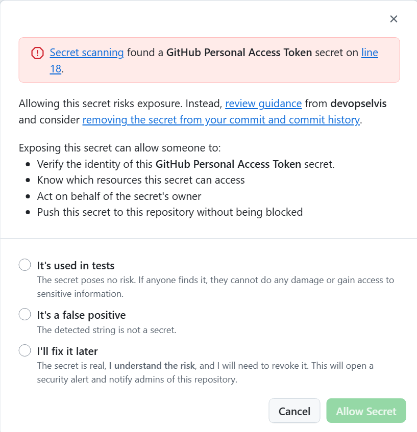

# Lab 5 - Hands-on with Secret Scanning

Let's use Secret Scanning with push protections to prevent secrets from entering the codebase!

## Exercise 1: Safely test push protection

1. Confirm that secret scanning and **Push protection** are enabled in the
   repository's **Settings → Code security and analysis** page.
2. Review `secrets.txt` in this repository. It contains only labelled,
   deliberately fake training fixtures; it is not a credential and must stay
   that way.
3. To exercise a real provider detector, use GitHub's documented
   [secret-scanning test
   procedure](https://docs.github.com/en/code-security/secret-scanning/working-with-secret-scanning-and-push-protection/testing-secret-scanning)
   or an instructor-provided provider-approved test fixture. Follow that
   procedure exactly and do not create a personal access token.
4. Use a temporary branch and file, attempt the push, and confirm that Push
   protection blocks the provider-approved test value. Do not bypass the
   block.
5. Delete the temporary branch and file after the exercise. Never paste a
   real token into source code, a commit, an issue, or chat.

  In the UI:   

If a real credential is ever exposed, stop using it, revoke it at the issuing
provider, rotate dependent credentials, and notify the repository owner or
security team. Removing the line, closing the pull request, or deleting the
branch is not sufficient.

## Summary

Celebrate 🎉! We just prevented a secret from entering our codebase!

And there you have it. You should now have a good grasp on what GitHub Advanced Security is, how it works, and how to implement it. So get out there and keep your company secured!

➡️ Head to the next [lab](lab6.md).
